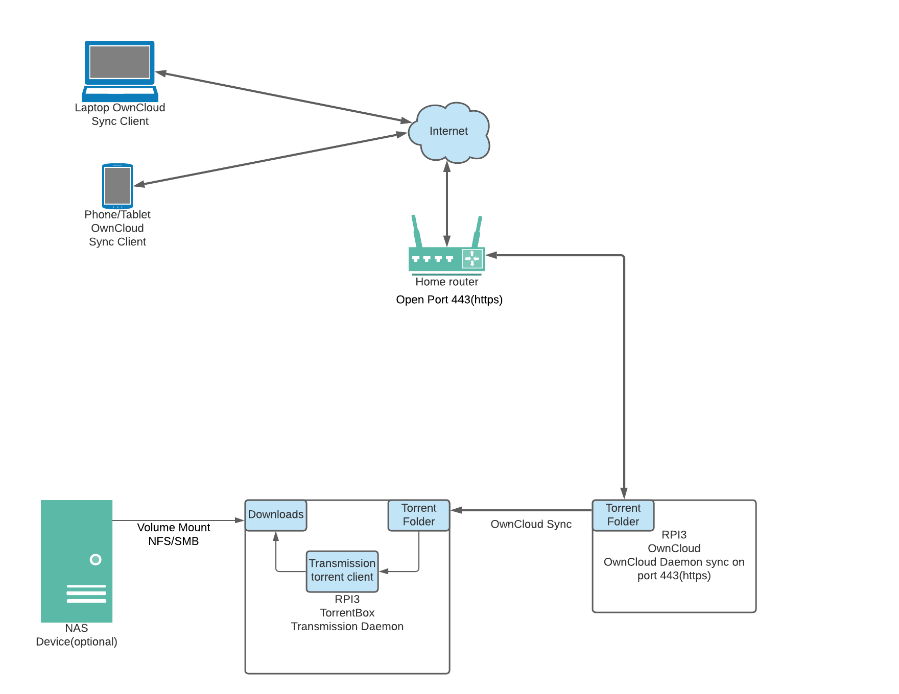
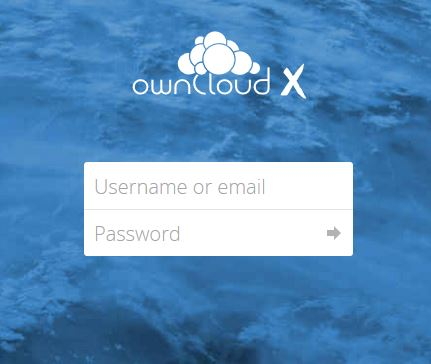
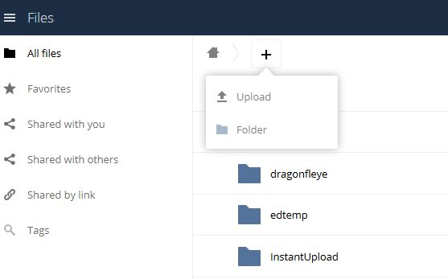
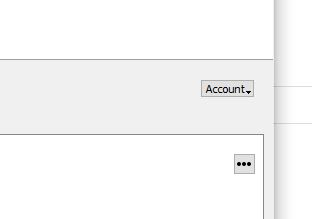
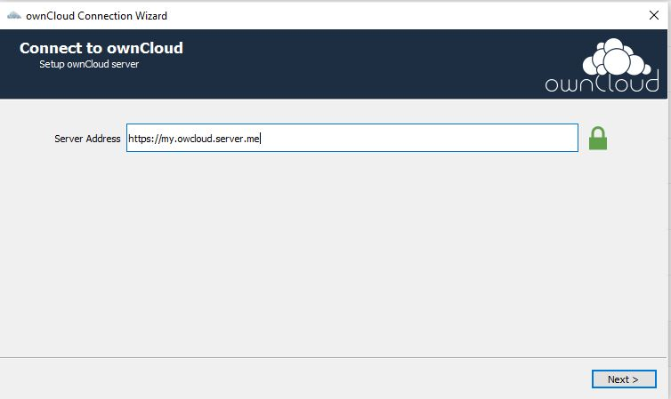

# Torrent box

An automated torrent box that can be used from anywhere. Dump your torrents into a sync folder and automatically pull down torrents.

## Background

In a mobile world it can be cumbersome to download a large torrent file, especially while out on the go. It can also be against the rules of some public wifi access points to do so.
So, in oder to get around these limitations you will need to have a torrent base station set up at home that can act like a torrent concierge.

## Parts Needed

1. Single board computer(SBC) - in this walkthrough Raspberry PI 3(PI3) is used, but any should work.
2. USB flash drive or HD - we will be using a sandisk 64GB flash drive but any size should work.
3. Owncloud Community edition or Google Drive account.
4. Transmission torrent client
5. Raspberry Pi OS - used on PI3

## Overall architecture



## Configuration

In this example we will set up OwnCloud as our sync mechanism. If you want to use Dropbox or GDrive, the set up will be very similar.

### Set up OwnCloud
In order to run OwnCloud efficently, it will run in Docker.

**Install Docker on RaspberryPi OS**

*NOTE: In make sure to pick the correct docker version to match your host.*

Full Docker install instructions can be found here. [Docker Install](https://docs.docker.com/engine/install/)

Once Docker is set up and running, we will install OwnCloud

**Set Up OwnCloud**

Starting OwnCloud with Docker is very straight forward. Run the following command.

*NOTE: You will need to choose a storage location on your local file system.*

```
$docker pull owncloud:latest

# Make sure the pulled image matches your system architecture.
$docker inspect <image id>

$ docker run -d -p 443:443 owncloud:latest -v /location/on/local/host:/var/www/html
```

### Set up Transmission

Transmission is the Bit Torrent client we will use to process our torrent files. We are useing transmission because it is reliable, easy to set up, and runs as a daemon.

```
$ sudo apt-get install transmission-daemon

# The daemon will start up by default, and needs to be stopped.
$ sudo systemctl stop transmission-daemon

# Edit the JSON config
$ vi /etc/transmission-daemon/settings.json

# Edit the following keys
"bind-address-ipv4": "0.0.0.0"
"dht-enabled": true
"download-dir": "/home/pi/Downloads/torrentbox"
"incomplete-dir": "/home/pi/Downloads/torrentbox/torrent-inprogress"
"rpc-bind-address": "0.0.0.0"
"rpc-port": 9091
"rpc-url": "/transmission/"
"rpc-username": "transmission"
"rpc-whitelist": "127.0.0.1"

# Do not restart the daemon yet.
```

### Create volume mount (optional)

If you have an external NAS device, you can create a share and mount it to your Raspberry PI. In this example we are using NFS to share a folder from the NAS.
We then mount it to a folder in the home directory. To do this, and make sure it is automatically mounted at boot we will need to edit the fstab folder. This folder will be
used to pull the torrent files to.
```
$ mkdir -p /home/pi/Downloads/torrentbox

#This is for NFS mount(optional)
$ sudo echo 'nashost_ip:/data/torrentbox /home/pi/Downloads/torrentbox nfs defaults 0 0' >> vi /etc/fstab

#This is for local filesystem
sudo echo /my/path/to/storage /home/pi/Downloads/torrentbox ext4 defaults 0 0' >> vi /etc/fstab

$ sudo mount -a
```

## Hook everything together

Once everything is setup, we will need to connect everything together.

### Create an OwnCloud sync dir

1. Log into the OwnCloud dashboard.

```
https://my.owncloud.server.me
```



2. Create a new sync directory that you can dump the .torrent files in.



Call the directory what ever you wish.


3. The directory will be ready to use, no further config is neccessary.

### Set up your clients

*NOTE: Windows 10 is used in this example, other platforms work the same.*

1. Download the correct OwnCloud client.

[OwnCloud client install](https://owncloud.com/desktop-app/)

[OwnCloud mobile install](https://owncloud.com/mobile-apps/)

2. Connect to your owncloud server.



Enter your server URl and follow the prompts.



## Start up Transmission

When you start Transmission the write directory will be torrentbox directory, and the read directory will be the OwnCloud Torrent directory. In daemon mode, Transmission will automatically pick up the torrent file from the Torrent directory, and pull the payload down to the torrentbox directory.

-c - Directory where .torrent files sync

-w - Directory where torrent payloads are downloaded

```
#Start Transmission as a daemon and make sure it can see your owncloud sync directory
$ transmission-daemon --help

$ transmission-daemon -c /home/pi/ownCloud/Torrent/ -w /home/pi/Downloads/torrentbox/ -f -ep -gsr 0.0 -T --log-debug
```

## Test Torrentbox

Download a torrent file and add it to the sync directory. The .torrent file will sync to the torrentbox.

Once synced, the Transmission daemon will pick up the .torent file and start to pull the payload down.

Once Transmission is set up you can access it via a web interface to check the status or torrent payloads.

```
http://localhost:9091/transmission
```

In order to use a mobile device on the move, you will need to make sure that the owncloud server is passed through any firewalls or NAT devices you may have. In this case you would pass port 44 through the fiewall. If you customize the install and use a different port make sure to forward that port and not port 443.